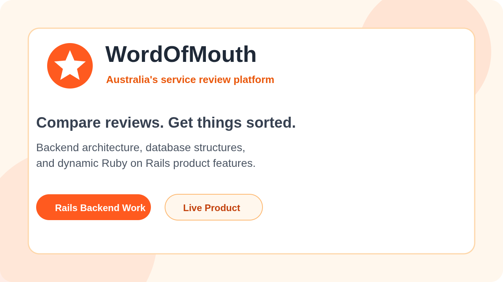
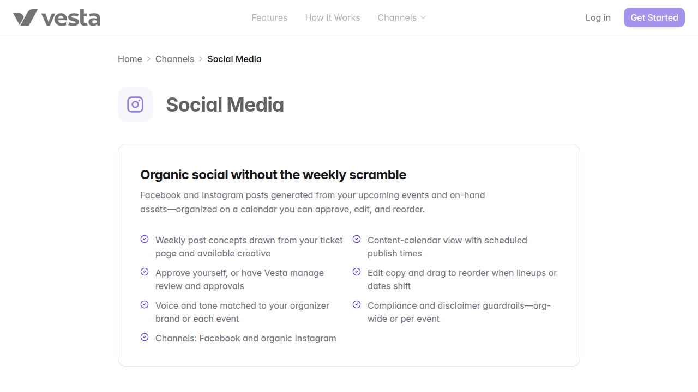
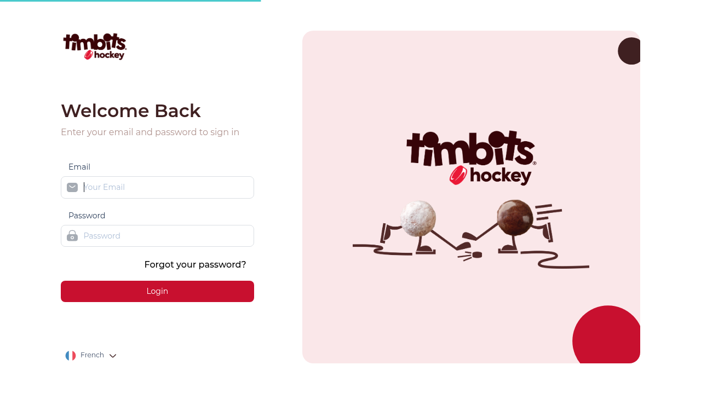
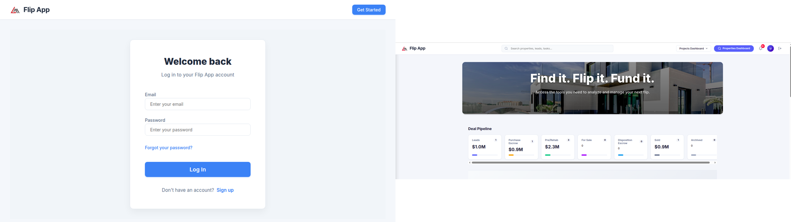
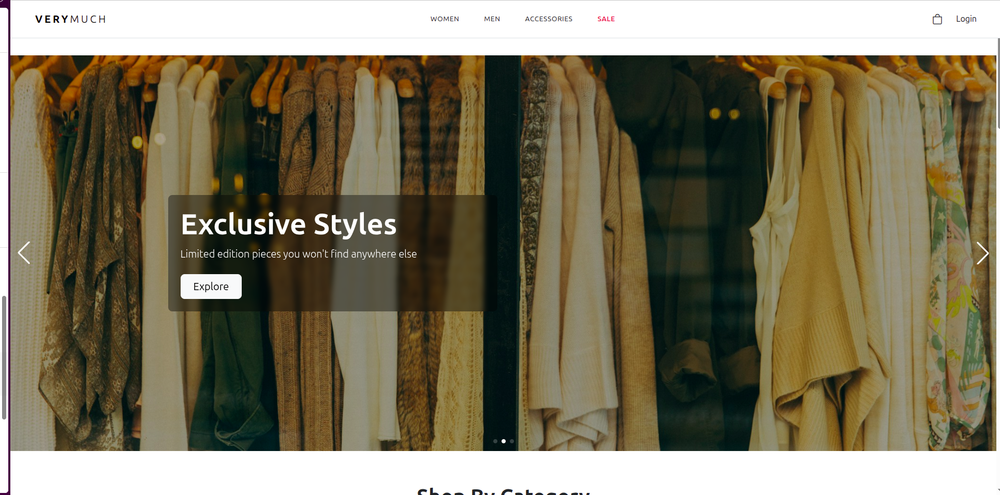

#  Hi, I'm Usama Faisal

  

  
  
  
  

 

  

---

## 🚀 About Me

I'm a versatile **Software Engineer** specializing in **Ruby on Rails back-end development**, RESTful APIs, scalable database structures, and third-party integrations. I also bring hands-on experience with **React, React Native, Python, Firebase, and mobile UI development**, with an active interest in **blockchain** and Web3 products.

- 🔭 Currently working as a Ruby on Rails Software Engineer
- 🧠 Strong in backend architecture, APIs, databases, and product-focused development
- 📱 Experienced in React Native mobile apps and animated UI screens
- 🌱 Continuously learning blockchain, Web3, and decentralized app concepts
- 👯 Open to collaboration on backend, mobile, and full-stack product ideas
- 💬 Ask me about Ruby on Rails, REST APIs, React Native, blockchain, or tech in general
- 😄 Pronouns: He/Him
- ⚡ Fun fact: I love coding and coffee in equal measure

---

## 🧰 Tech Toolbox

  

 

  
  
  
  
  
  
  
  
  
  

---

## 💼 What I Like Building

<table>
  <tr>
    <td width="50%">
      <h3>⚙️ Backend Systems</h3>
      
Ruby on Rails APIs, database architecture, subscriptions, payments, integrations, and scalable product features.

    </td>
    <td width="50%">
      <h3>📱 Mobile Apps</h3>
      
Modern, responsive, and smooth mobile experiences with strong attention to UI, performance, and usability.

    </td>
  </tr>
  <tr>
    <td width="50%">
      <h3>🔌 API Integrations</h3>
      
Third-party services, social APIs, advertising APIs, CRMLS listing data, and workflow automation.

    </td>
    <td width="50%">
      <h3>🔗 Blockchain Ideas</h3>
      
Exploring Web3 products, decentralized app concepts, smart contracts, wallets, and crypto-powered workflows.

    </td>
  </tr>
</table>

---

## 🏢 Professional Experience

| Role | Company | Highlights |
| --- | --- | --- |
| Software Engineer - Ruby on Rails | Stackworx | Working on real estate platforms, property data integrations, CRMLS listing sync, and filtered property discovery experiences. |
| Associate Software Engineer - Ruby on Rails | A's Techware | Built scalable Rails backends, database structures, REST APIs, subscription/payment systems, React components, and Facebook/Google Ads integrations. |
| SecOps Automation Intern | Systems Limited | Built authenticated React frontends backed by Python REST APIs and SQL database integrations. |
| React Native Intern | ZIMO Group | Designed responsive and animated mobile UI screens using React Native CLI. |

---

## 🎓 Education

**Bachelor of Science in Computer Science** - National University of Computer and Emerging Sciences (FAST NUCES), 2023

---

## 🌍 Live Projects

<table>
  <tr>
    <td width="50%" valign="top">
      
      <h3>WordOfMouth</h3>
      
Scalable Ruby on Rails backend architecture, database structures, and dynamic product features.

    </td>
    <td width="50%" valign="top">
      
      <h3>Event Vesta Overview</h3>
      
Subscription/payment systems, structured database models, and scalable backend solutions.

    </td>
  </tr>
  <tr>
    <td width="50%" valign="top">
      
      <h3>GolfPay360</h3>
      
Live product development and backend-focused feature work.

    </td>
    <td width="50%" valign="top">
      
      <h3>Timbits Sports</h3>
      
Live product development across practical product workflows.

    </td>
  </tr>
  <tr>
    <td width="50%" valign="top">
      
      <h3>Flip App</h3>
      
Real estate platform work involving property data, CRMLS listing sync, and data integration.

    </td>
    <td width="50%" valign="top">
      
      <h3>Very Much</h3>
      
Personal project built and deployed as a live web experience.

    </td>
  </tr>
</table>

---

## 🧩 Selected Projects

- **Food Grid** - React Native, Expo, and Firebase food-ordering app with meal customization and nutrient details
- **Final Paper Scheduler** - Python-based scheduling system using AI concepts to generate clash-free exam timetables

---

## 🎯 Current Focus

- Building scalable Ruby on Rails APIs and reliable database-backed products
- Improving backend architecture, third-party integrations, and payment/subscription flows
- Creating clean React and React Native user experiences
- Learning blockchain fundamentals, Web3 workflows, and smart contract ideas

---

## 🤝 Let's Connect

  

    I'm always excited to connect with developers, creators, and teams building meaningful products.
  

  
  

 

  

