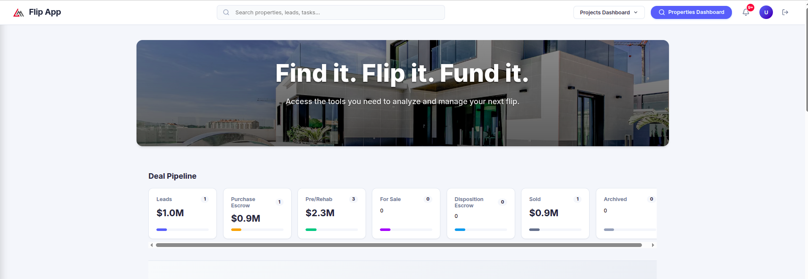
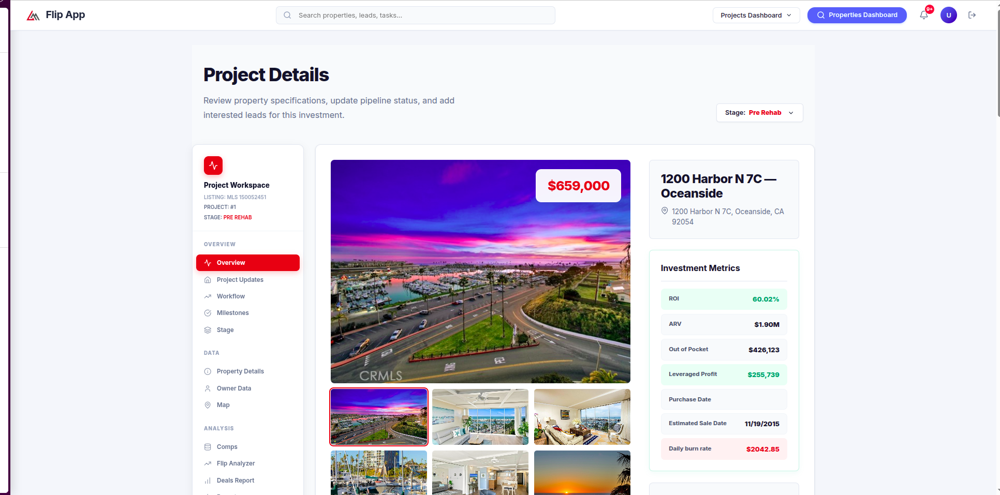

#  Hi, I'm Usama Faisal

<div align="center">
  
</div>

<div align="center">
  <a href="mailto:usamashk530@gmail.com">
    
  </a>
  <a href="https://www.linkedin.com/in/usama-faisal-488410231">
    
  </a>
  <a href="https://github.com/UsamaFaisal">
    
  </a>
  <a href="https://expo.dev/@usama530/FoodGrid?serviceType=classic&distribution=expo-go">
    
  </a>
  
</div>

<br />

<div align="center">
  
</div>

<div align="center">
  <a href="https://github.com/UsamaFaisal/UsamaFaisal/actions/workflows/update-readme.yml">
    
  </a>
</div>

---

## 🚀 About Me

```javascript
const usamaFaisal = {
  role: "React Native Developer",
  focus: "Building smooth, practical, and user-friendly mobile experiences",
  interests: ["Mobile apps", "Animated UI", "Frontend products", "Firebase"],
  currentlyBuilding: ["FoodGrid", "Flip App", "Very Much"],
  mindset: "Turn ideas into functional products with clean interfaces",
};
```

- 🔭 Building mobile-first and frontend product experiences
- 📱 Focused on **React Native**, **Expo**, and smooth UI flows
- 🧠 Interested in Firebase-backed apps, animations, and practical product features
- 🌱 Exploring stronger full-stack patterns and production-ready app workflows
- 👯 Open to collaboration on mobile, frontend, and product-focused ideas
- 💬 Ask me about React Native, Expo, Firebase, UI screens, or app prototyping

---

## 🧰 Tech Toolbox

<div align="center">
  
</div>

<br />

<div align="center">
  
  
  
  
  
  
  
</div>

---

## 💼 What I Like Building

<table>
  <tr>
    <td width="50%">
      <h3>📱 Mobile Apps</h3>
      <p>React Native and Expo apps with smooth navigation, clean screens, and product-ready flows.</p>
    </td>
    <td width="50%">
      <h3>🎨 Animated UI</h3>
      <p>Interactive interfaces, polished layouts, and motion that makes apps feel modern and usable.</p>
    </td>
  </tr>
  <tr>
    <td width="50%">
      <h3>🔥 Firebase Products</h3>
      <p>Authentication, storage, realtime data, and fast prototypes backed by practical cloud tooling.</p>
    </td>
    <td width="50%">
      <h3>🧩 Frontend Experiences</h3>
      <p>Responsive web pages, dashboards, and ecommerce-style product interfaces.</p>
    </td>
  </tr>
</table>

---

## 🌍 Featured Work

<table>
  <tr>
    <td width="50%" valign="top">
      <a href="https://flip-app-frontend.onrender.com">
        
      </a>
      <h3>Flip App</h3>
      <p>Real estate investment dashboard experience for tracking deal stages, lead values, and project progress.</p>
      <p>
        
        
      </p>
    </td>
    <td width="50%" valign="top">
      <a href="https://flip-app-frontend.onrender.com">
        
      </a>
      <h3>Flip App Project Details</h3>
      <p>Property detail workspace with gallery views, metrics cards, pipeline updates, and project navigation.</p>
      <p>
        
        
      </p>
    </td>
  </tr>
  <tr>
    <td width="50%" valign="top">
      <a href="https://very-much.vercel.app/">
        
      </a>
      <h3>Very Much</h3>
      <p>Fashion ecommerce web experience with category navigation, hero carousel, and clean shopping UI.</p>
      <p>
        
        
      </p>
    </td>
    <td width="50%" valign="top">
      <a href="https://expo.dev/@usama530/FoodGrid?serviceType=classic&distribution=expo-go">
        
      </a>
      <h3>FoodGrid</h3>
      <p>React Native, Expo, and Firebase food-ordering app with meal customization and mobile-first screens.</p>
      <p>
        
        
      </p>
    </td>
  </tr>
</table>

---

## 🧩 Selected Projects

- **FoodGrid** - React Native, Expo, and Firebase food-ordering app with meal customization and product-focused mobile flows
- **Final Paper Scheduler** - Python-based scheduling system for generating clash-free exam timetables
- **Inventory Management Blockchain** - Inventory workflow exploration with blockchain-oriented concepts
- **ECommerce / Very Much** - Ecommerce frontend experience with product discovery and responsive UI

---

## 📊 GitHub Stats

<div align="center">
  
  
</div>

<div align="center">
  
</div>

---

## 🔝 Recent Repositories

Public work under [@UsamaFaisal](https://github.com/UsamaFaisal), sorted by most recent push. This section is refreshed by the included GitHub Actions workflow.

<!-- RECENT_REPOS_START -->
| # | Repository | Language | Stars | Last push | Description |
|--:|:-----------|:---------|------:|:----------|:------------|
| 1 | [**UsamaFaisal**](https://github.com/UsamaFaisal/UsamaFaisal) | - | 0 | 2026-09-11 | My personal repository |
| 2 | [**her-birthday-main**](https://github.com/UsamaFaisal/her-birthday-main) | JavaScript | 0 | 2025-12-29 | - |
| 3 | [**Native_Project**](https://github.com/UsamaFaisal/Native_Project) | TypeScript | 0 | 2024-05-09 | - |
| 4 | [**CSVfile**](https://github.com/UsamaFaisal/CSVfile) | - | 0 | 2024-04-01 | - |
| 5 | [**WeatherApp**](https://github.com/UsamaFaisal/WeatherApp) | HTML | 0 | 2024-02-13 | - |
| 6 | [**QuizApp**](https://github.com/UsamaFaisal/QuizApp) | HTML | 0 | 2024-02-13 | - |
| 7 | [**TaskManager**](https://github.com/UsamaFaisal/TaskManager) | HTML | 0 | 2024-02-08 | - |
| 8 | [**ECommerce**](https://github.com/UsamaFaisal/ECommerce) | JavaScript | 0 | 2023-10-28 | - |
<!-- RECENT_REPOS_END -->

---

## 🎯 Current Focus

- Shipping practical React Native apps with clean mobile UX
- Improving Firebase-backed flows and reusable app architecture
- Building polished frontend screens for dashboards and ecommerce products
- Learning stronger full-stack delivery patterns and production deployment workflows

---

## 🤝 Let's Connect

<div align="center">
  <p>
    I'm always happy to connect with developers, creators, and teams building useful products.
  </p>

  <a href="mailto:usamashk530@gmail.com">
    
  </a>
  <a href="https://www.linkedin.com/in/usama-faisal-488410231">
    
  </a>
</div>

<br />

<div align="center">
  
</div>
